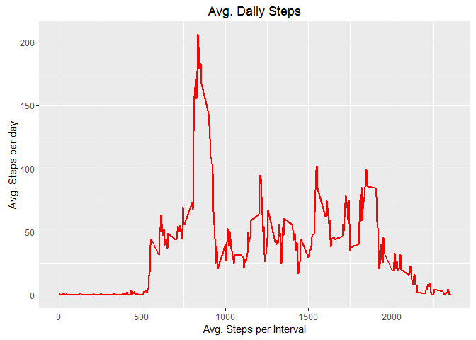

# Reproducible Research: Peer Assessment 1

## Loading and preprocessing the data

```r
## Load necessary packages
library(dplyr)
```

```
## 
## Attaching package: 'dplyr'
```

```
## The following objects are masked from 'package:stats':
## 
##     filter, lag
```

```
## The following objects are masked from 'package:base':
## 
##     intersect, setdiff, setequal, union
```

```r
library(ggplot2)
setwd("D:/Coursera/Reproducible Research/RepData_PeerAssessment1")
data <- read.csv("activity.csv")  
dim(data)
```

```
## [1] 17568     3
```


```r
summary(data)
```

```
##      steps                date          interval     
##  Min.   :  0.00   2012-10-01:  288   Min.   :   0.0  
##  1st Qu.:  0.00   2012-10-02:  288   1st Qu.: 588.8  
##  Median :  0.00   2012-10-03:  288   Median :1177.5  
##  Mean   : 37.38   2012-10-04:  288   Mean   :1177.5  
##  3rd Qu.: 12.00   2012-10-05:  288   3rd Qu.:1766.2  
##  Max.   :806.00   2012-10-06:  288   Max.   :2355.0  
##  NA's   :2304     (Other)   :15840
```


```r
## Convert Date
data$date<- as.Date(data$date)  
```

## What is mean total number of steps taken per day?

```r
## 1.Calculate and output total steps taken per day
total_steps <- data%>%
  group_by(date)%>%
        filter(!is.na(steps))%>%
        summarise(total_steps = sum(steps, na.rm=TRUE))
total_steps
```

```
## # A tibble: 53 x 2
##          date total_steps
##        <date>       <int>
## 1  2012-10-02         126
## 2  2012-10-03       11352
## 3  2012-10-04       12116
## 4  2012-10-05       13294
## 5  2012-10-06       15420
## 6  2012-10-07       11015
## 7  2012-10-09       12811
## 8  2012-10-10        9900
## 9  2012-10-11       10304
## 10 2012-10-12       17382
## # ... with 43 more rows
```

```r
## 2.Histogram of the total number of steps taken each day
ggplot(total_steps, aes(x = total_steps)) +
        geom_histogram(fill = "green", binwidth = 1000) +
        labs(title = "Daily Steps", x = "Total Steps", y = "Frequency")
```

<!-- -->

```r
## 3.Mean of the total number of steps taken per day 
mean_steps <- mean(total_steps$total_steps, na.rm=TRUE)
mean_steps
```

```
## [1] 10766.19
```

```r
## 4.Median of the total number of steps taken per day 
median_steps<- median(total_steps$total_steps, na.rm=TRUE)
median_steps
```

```
## [1] 10765
```

## What is the average daily activity pattern?

```r
## 1. Calculate Avgerage Steps
avg_steps_per_interval <- data%>%
        group_by(interval)%>%
        filter(!is.na(steps))%>%
        summarise(avg_steps = mean(steps, na.rm=TRUE))
avg_steps_per_interval
```

```
## # A tibble: 288 x 2
##    interval avg_steps
##       <int>     <dbl>
## 1         0 1.7169811
## 2         5 0.3396226
## 3        10 0.1320755
## 4        15 0.1509434
## 5        20 0.0754717
## 6        25 2.0943396
## 7        30 0.5283019
## 8        35 0.8679245
## 9        40 0.0000000
## 10       45 1.4716981
## # ... with 278 more rows
```

```r
## 2. Plot the Average
ggplot(avg_steps_per_interval, aes(x =interval , y=avg_steps)) +
        geom_line(color="red", size=1) +
        labs(title = "Avg. Daily Steps", x = "Avg. Steps per Interval", y = "Avg. Steps per day")
```

<!-- -->

```r
## 3. Which 5-minute interval, on average across all the days in the dataset, contains the maximum number of steps?
avg_steps_per_interval[which.max(avg_steps_per_interval$avg_steps),]
```

```
## # A tibble: 1 x 2
##   interval avg_steps
##      <int>     <dbl>
## 1      835  206.1698
```

## Imputing missing values

```r
## 1. Total number of missing values in the dataset
sum(is.na(data$steps))
```

```
## [1] 2304
```

```r
## 2. Imputing missing values using mean for each day and Create a new dataset with imputed data
imputed_data <- data
nas <- is.na(imputed_data$steps)
avg_interval <- tapply(imputed_data$steps, imputed_data$interval, mean, na.rm=TRUE, simplify = TRUE)
imputed_data$steps[nas] <- avg_interval[as.character(imputed_data$interval[nas])]
names(imputed_data)
```

```
## [1] "steps"    "date"     "interval"
```

```r
## 3. Ensure there are no missing values
sum(is.na(imputed_data))
```

```
## [1] 0
```

```r
## 5. Summarize the step data using the imputed data set
total_steps2 <- imputed_data%>%
        group_by(date)%>%
        summarise(total_steps = sum(steps, na.rm=TRUE))
total_steps2
```

```
## # A tibble: 61 x 2
##          date total_steps
##        <date>       <dbl>
## 1  2012-10-01    10766.19
## 2  2012-10-02      126.00
## 3  2012-10-03    11352.00
## 4  2012-10-04    12116.00
## 5  2012-10-05    13294.00
## 6  2012-10-06    15420.00
## 7  2012-10-07    11015.00
## 8  2012-10-08    10766.19
## 9  2012-10-09    12811.00
## 10 2012-10-10     9900.00
## # ... with 51 more rows
```

```r
## 6. Plot the imputed_data
ggplot(total_steps2, aes(x = total_steps)) +
        geom_histogram(fill = "blue", binwidth = 1000) +
        labs(title = "Daily Steps including Missing values", x = "Interval", y = "No. of Steps")
```

<!-- -->

```r
## Now to answer question
## Do these values differ from the estimates from the first part of the assignment? 
## What is the impact of imputing missing data on the estimates of the total daily number of steps?

## 7. Calculate Mean
mean_steps2 <- mean(total_steps2$total_steps) ## na.RM is not necessary since we defaulted the data already
mean_steps2
```

```
## [1] 10766.19
```

```r
## 8. Calculate Median
median_steps2<- median(total_steps2$total_steps)
median_steps2
```

```
## [1] 10766.19
```

```r
## Answer/Conclusion: Mean and Median are the same due to the fact that we imputed the missing data.
```

## Are there differences in activity patterns between weekdays and weekends?

```r
## 1. Create new varibale called WeekType for Weekday & Weekend
imputed_data<- imputed_data%>%
        mutate(weektype= ifelse(weekdays(imputed_data$date)=="Saturday" | weekdays(imputed_data$date)=="Sunday", "Weekend", "Weekday"))
head(imputed_data)
```

```
##       steps       date interval weektype
## 1 1.7169811 2012-10-01        0  Weekday
## 2 0.3396226 2012-10-01        5  Weekday
## 3 0.1320755 2012-10-01       10  Weekday
## 4 0.1509434 2012-10-01       15  Weekday
## 5 0.0754717 2012-10-01       20  Weekday
## 6 2.0943396 2012-10-01       25  Weekday
```

```r
## 2. Group the data for plotting  
avg_steps_per_interval2 <- imputed_data%>%
        group_by(interval, weektype)%>%
        summarise(avg_steps2 = mean(steps))
head(avg_steps_per_interval2)
```

```
## Source: local data frame [6 x 3]
## Groups: interval [3]
## 
##   interval weektype avg_steps2
##      <int>    <chr>      <dbl>
## 1        0  Weekday 2.25115304
## 2        0  Weekend 0.21462264
## 3        5  Weekday 0.44528302
## 4        5  Weekend 0.04245283
## 5       10  Weekday 0.17316562
## 6       10  Weekend 0.01650943
```

```r
## 3. Plot the data
plot <- ggplot(avg_steps_per_interval2, aes(x =interval , y=avg_steps2, color=weektype)) +
       geom_line() +
       labs(title = "Avg. Daily Steps by Weektype", x = "Interval", y = "No. of Steps") +
       facet_wrap(~weektype, ncol = 1, nrow=2)
print(plot)
```

<!-- -->

```r
## Answer/Conclusion: On weekdays, the test subject is less active during the day due to work, while the subject is more active through out the day during weekends.
```
